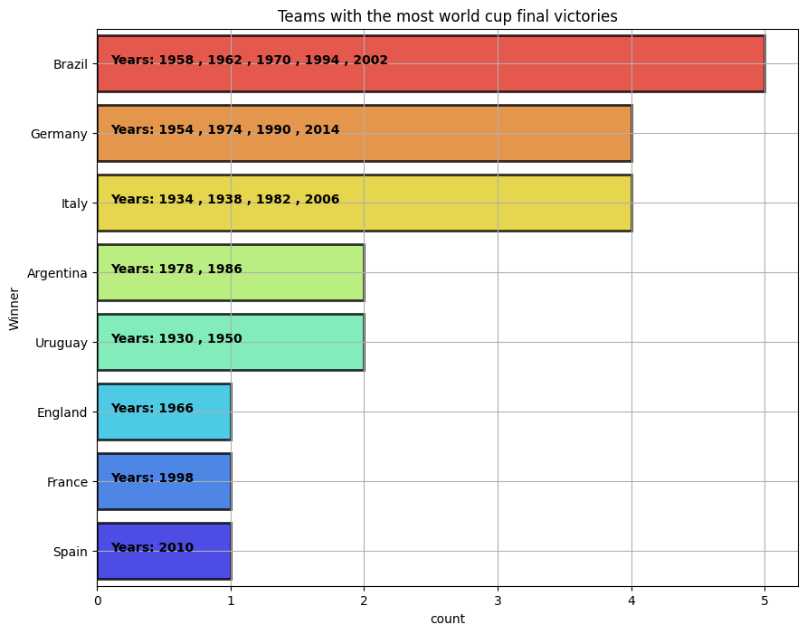
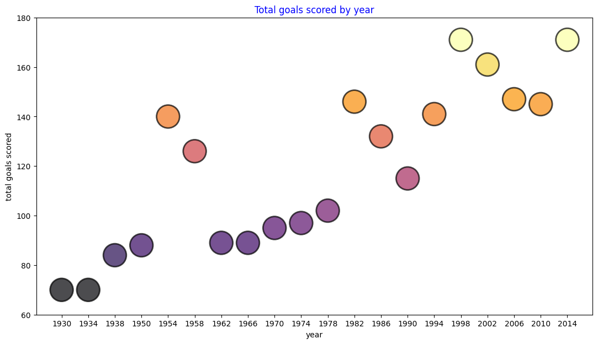
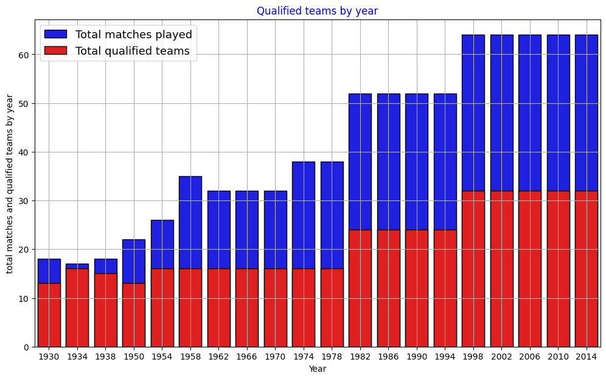
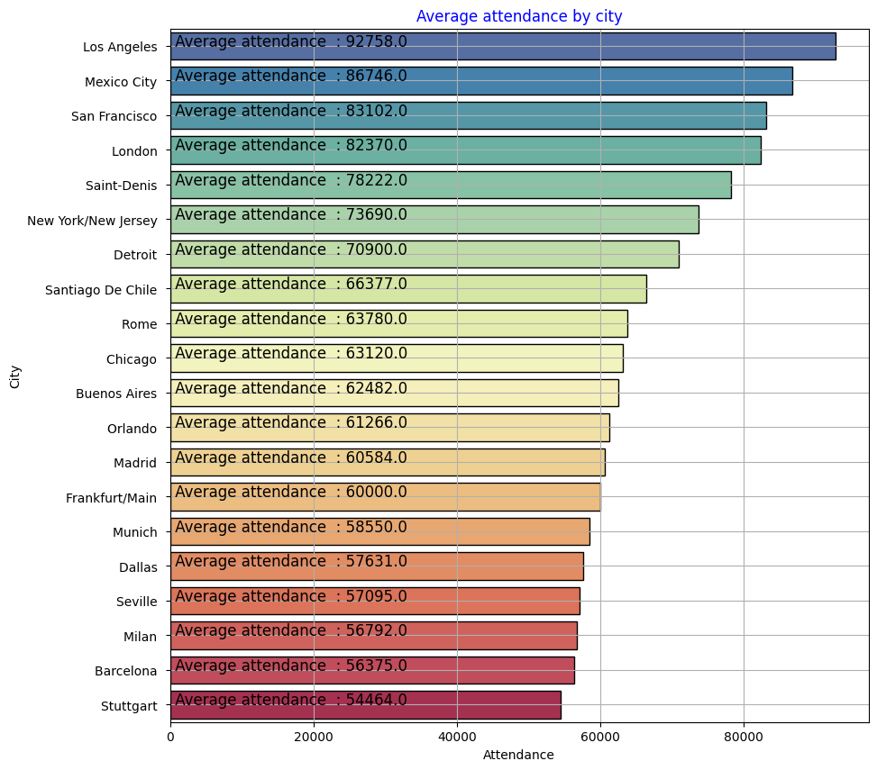
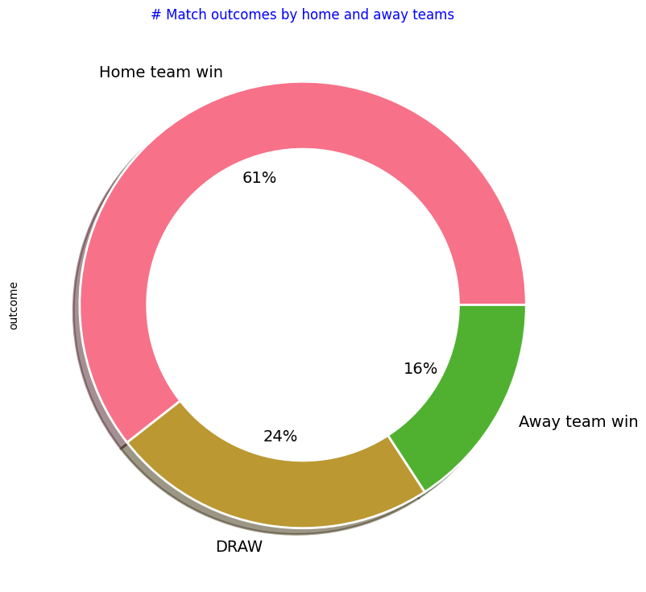

# FIFA World Cup Analysis — 84 Years of Tournament Data


Analysis of every FIFA World Cup from 1930 to 2014 across three linked datasets — tournaments,
matches and players — answering a set of scouting questions posed by a newly formed club.



---

## Problem statement

A newly inaugurated football club, *Brussels United FC*, needs a factual briefing on World Cup
history before making scouting and fixture decisions. The brief asks specific questions rather
than a general survey:

- Which nations have won most, and when?
- How have goals, attendance and tournament size changed over time?
- Which cities and stadiums draw the biggest crowds?
- **Is playing at home actually an advantage?**

## Datasets

Three linked CSVs covering the tournament from its 1930 inauguration through 2014.

| File | Contents | Grain |
|---|---|---|
| `WorldCups.csv` | Winner, runners-up, third, fourth, goals, qualified teams, matches, attendance | One row per tournament |
| `WorldCupMatches.csv` | Date, stage, stadium, city, both teams, goals, half-time goals, attendance, referees | One row per match |
| `WorldCupPlayers.csv` | Team, coach, line-up, shirt number, player, position, events | One row per player per match |

## Tech stack

pandas · NumPy · Matplotlib · Seaborn

## Approach

1. **Load and profile** all three datasets; reconcile the keys (`RoundID`, `MatchID`) that link them.
2. **Clean** — handle missing values, correct dtypes, resolve historical country-name inconsistencies.
3. **Aggregate** along each dimension the brief asks about: year, nation, city, stadium, home/away.
4. **Visualise** each answer as a standalone chart.

## Findings

### Tournament evolution



The field expanded in deliberate steps: **16 teams** from 1934 to 1978 (with two exceptions —
15 in 1938 after Austria was absorbed into Germany post-qualification, and 13 in 1950 after India,
Scotland and Turkey withdrew), **24 teams from 1982**, and **32 from 1998**, which opened the
tournament to more nations from Africa, Asia and North America.



Total goals per tournament rises with the field size — the interesting question is whether goals
*per match* followed, and it largely did not.

### Titles

Twenty tournaments have been won by **eight** national teams:

| Titles | Nation |
|---|---|
| 5 | **Brazil** — 1958, 1962, 1970, 1994, 2002 |
| 4 | Germany |
| 4 | Italy |
| 2 | Argentina |
| 2 | Uruguay (inaugural winner, 1930) |
| 1 | England · France · Spain |

Brazil is also the only nation to have played in every single tournament.

### Attendance



**Mexico City records the highest average attendance at 93,807** — comfortably ahead of any other
host city. The busiest host city staged **23 matches**.

### Home advantage



Across the full match history, **home teams win more often than away teams** — the home-advantage
effect the brief asked about is visible in the data and holds across eras.

## Answers to the brief

| Question | Answer |
|---|---|
| Most World Cup victories | Brazil, 5 titles |
| Highest average attendance by city | Mexico City, 93,807 |
| Most matches hosted by one city | 23 |
| Number of winning nations | 8, across 20 tournaments |
| Is home advantage real? | Yes — home teams win more matches than away teams |

## Running it

```bash
git clone https://github.com/Bennittah/Fifa.git
cd Fifa
pip install pandas numpy matplotlib seaborn jupyter
jupyter notebook Fifa_eda_and_pre_processing.ipynb
```

All three CSVs are included in the repository. The notebook renders directly on GitHub with all
outputs intact.

---

*Part of my applied analytics portfolio — see [my profile](https://github.com/Bennittah) for more.*
